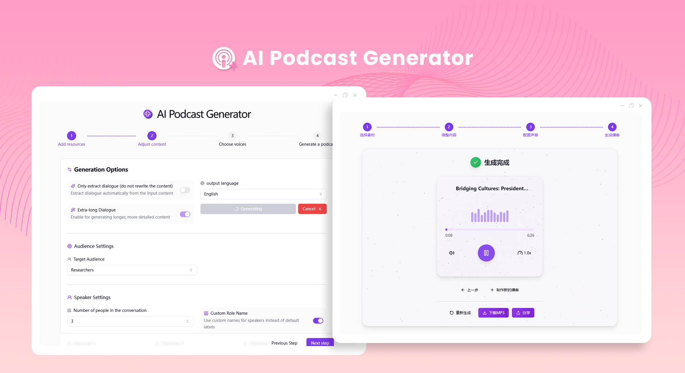
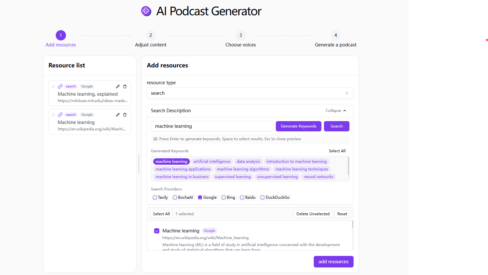
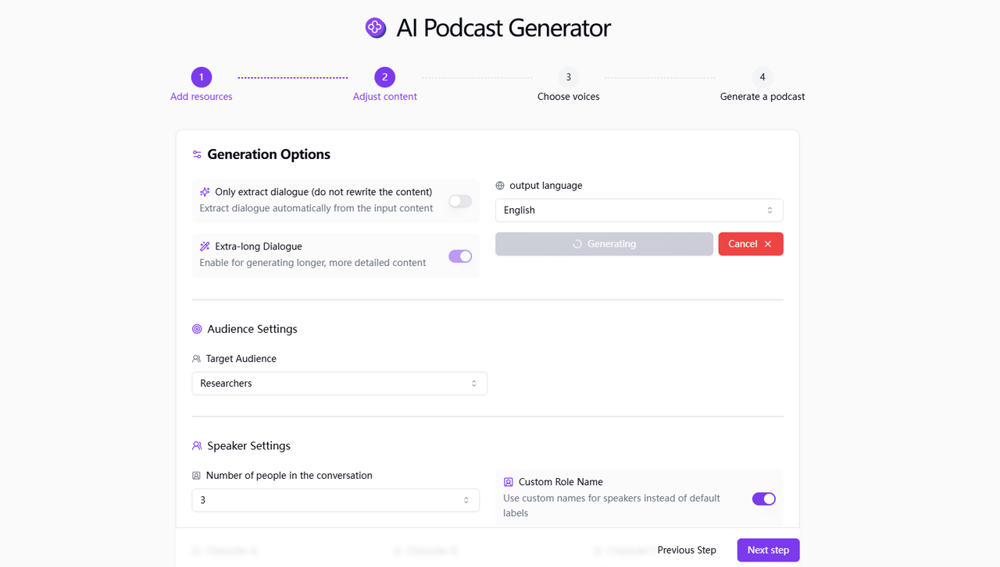
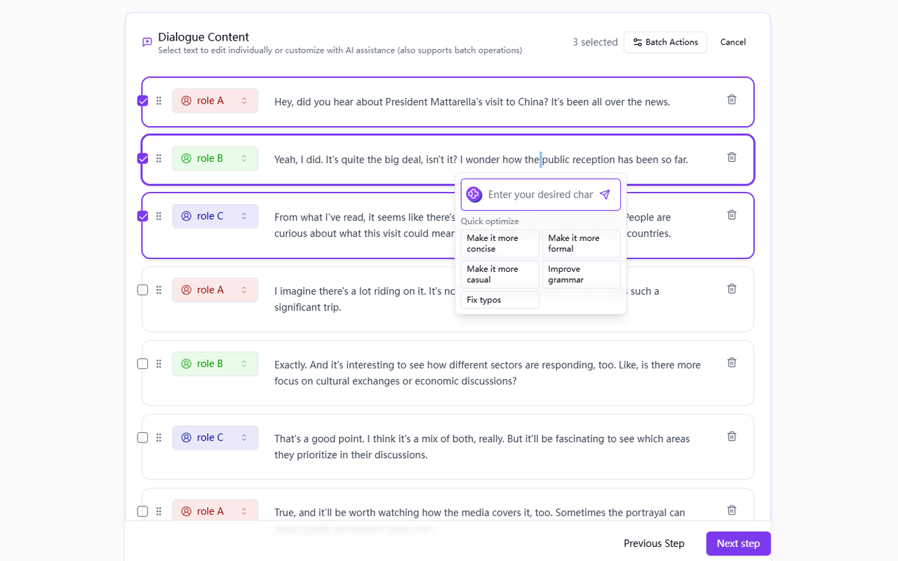
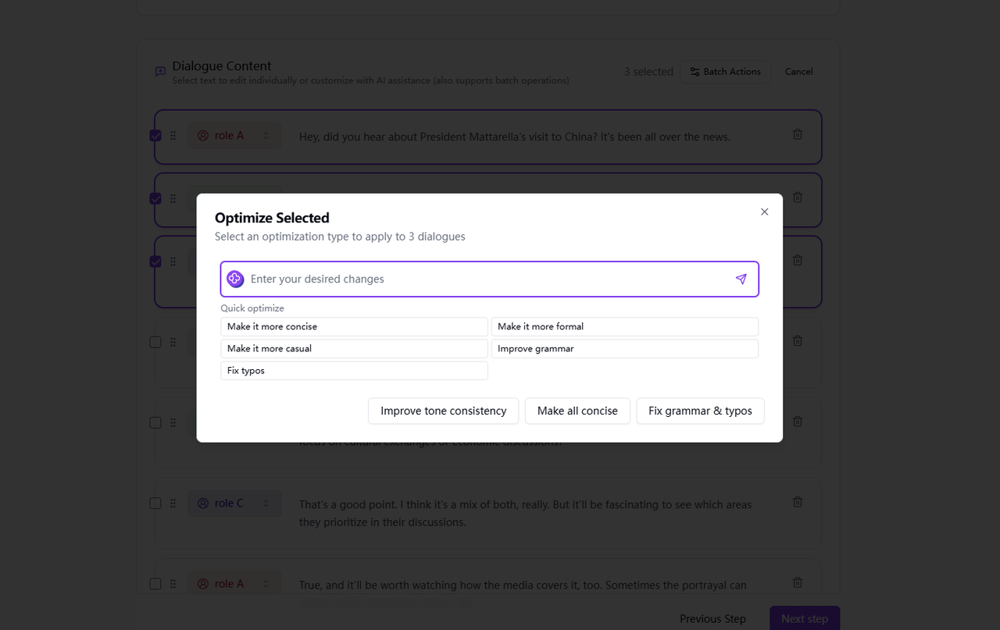
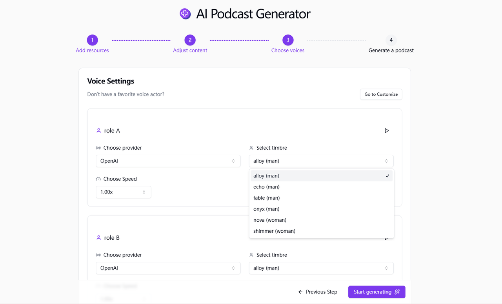
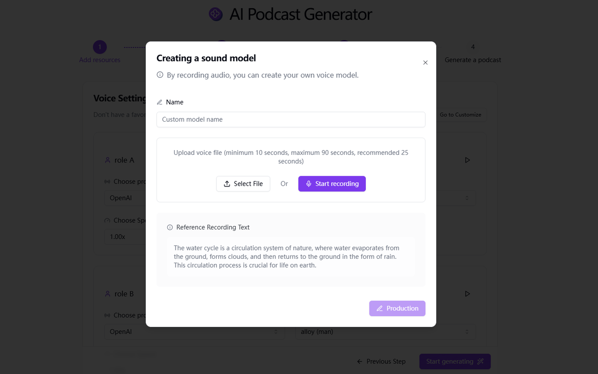
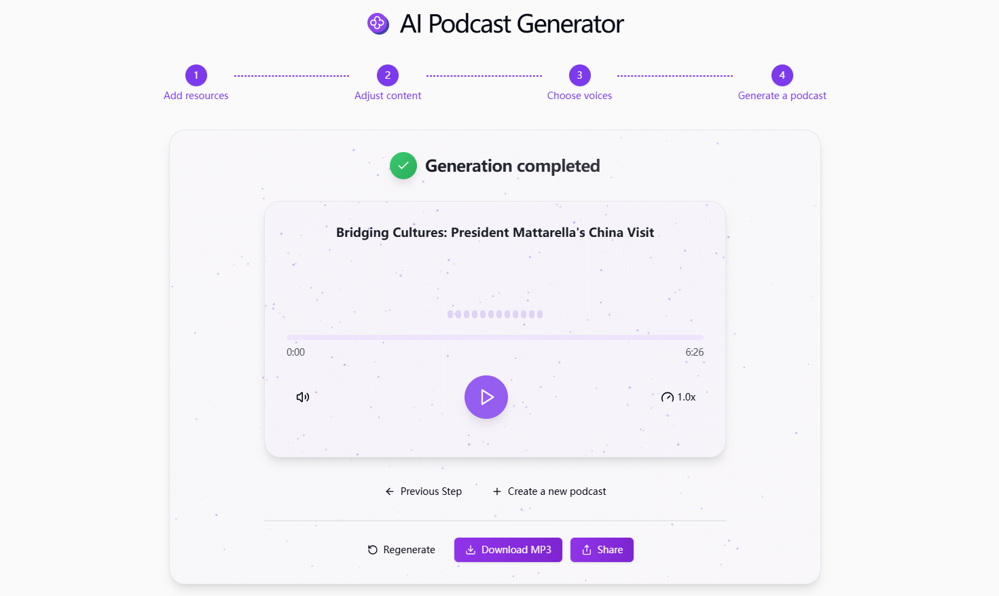

# 
🎙️ AI Podcast Generator 🚀✨

The AI podcast generator uses large language models to generate conversation content by submitting various materials such as pictures, texts, links, and files, and it also supports the synthesis of background music to generate high-quality podcast audio.

<a href="README_zh.md">中文</a> | <a href="README.md">English</a> | <a href="README_ja.md">日本語</a>

Open-source version of the [AI Podcast Generator](https://302.ai/en/tools/podcast/) from [302.AI](https://302.ai/en/).
You can directly log in to 302.AI for a zero-code, zero-configuration online experience.
Alternatively, customize this project to suit your needs, integrate 302.AI's API KEY, and deploy it yourself.

## Interface Preview
Support multiple ways to add resources, generate keywords based on descriptions for search, and choose to add the search results as resource materials.
   

By using the "Long Dialogue" feature to generate podcast scripts, not only can you select the target audience for podcast content, but you can also set roles and customize prompt words.
   

After generating the conversation, you can select the text for individual editing or use AI optimization to modify it.
    

You can select dialogue content in bulk for batch operations.
    

There are multiple speech models and packages to choose from, and you can also select background music to configure the sound for your podcast.
    

You can create a personalized speech model by recording audio.
 

Once the complete podcast is generated, it can be downloaded, shared or regenerated.

## Project Features
###  🎯  Material selection
Support multiple ways to add resources as materials.
###  📝  Dialogue generation
- You can choose the mode for generating conversation content or customize prompt words.
- Provide audience selection and adjust the output tone of podcast scripts according to different audience groups.
###  🎭  AI Role Playing
Create a unique podcast host role to give your program a unique personality.
###  ✏️  Real time editing
- Adjust and modify the content at any time during the generation process, and even use AI to assist you in editing and optimizing the content.
- Support batch selection of conversation content for batch operations.
### 🗣️ Text-to-Speech
Convert the generated scripts into lifelike voices. Multiple voices and languages are available for selection, and you can even create your own exclusive voice.
### 🎶 Background Music and Sound Effects
Automatically add appropriate background music and sound effects to enhance the listener experience.
### 📜 History Record
Save your creation history so that nothing is forgotten, and you can download it anytime and anywhere.
### 🌐 Share Support
Share with one click to major social platforms.
### 🌓 Dark Mode
Support the dark mode to protect your eyes.
### 🌍 多言語サポート
- 中国語インターフェース
- 英語インターフェース
- 日本語インターフェース

With AI Podcast Generator, anyone can become a podcast creator! 🎉🎙️ Let's explore the new world of AI-driven podcasting together! 🌟🚀

## 🚩 Future Update Plans
- [ ] Optimize logical coherence
- [ ] Provide more detailed personalized style customization options, allowing users to precisely set the style tendency of the generated conversation content, so that the podcast can better match the preferences of the target audience and the brand image of the creator

## Tech Stack
- Next.js 14
- Tailwind CSS
- Shadcn UI
- Tiptap
- Vercel AI SDK
- Prisma
- MongoDB

## Development & Deployment
1. Clone the project: `git clone https://github.com/302ai/302_podcast_generator`
2. Install dependencies: `pnpm install`
3. Configure environment variables: Refer to .env.example
4. Run the project: `pnpm prisma generate && pnpm dev`
5. Build and deploy: `docker build -t podcast-generator . && docker run -p 3000:3000 podcast-generator`

## ✨ About 302.AI ✨
[302.AI](https://302.ai) is an enterprise-oriented AI application platform that offers pay-as-you-go services, ready-to-use solutions, and an open-source ecosystem.✨
1. 🧠 Comprehensive AI capabilities: Incorporates the latest in language, image, audio, and video models from leading AI brands.
2. 🚀 Advanced application development: We build genuine AI products, not just simple chatbots.
3. 💰 No monthly fees: All features are pay-per-use, fully accessible, ensuring low entry barriers with high potential.
4. 🛠 Powerful admin dashboard: Designed for teams and SMEs - managed by one, used by many.
5. 🔗 API access for all AI features: All tools are open-source and customizable (in progress).
6. 💡 Powerful development team: Launching 2-3 new applications weekly with daily product updates. Interested developers are welcome to contact us.
