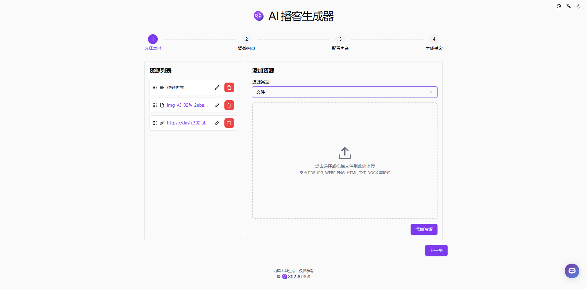
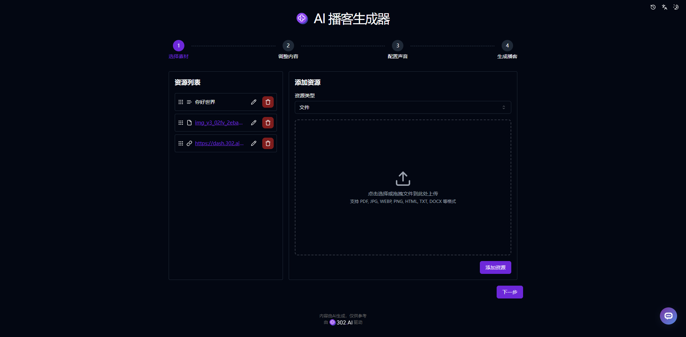
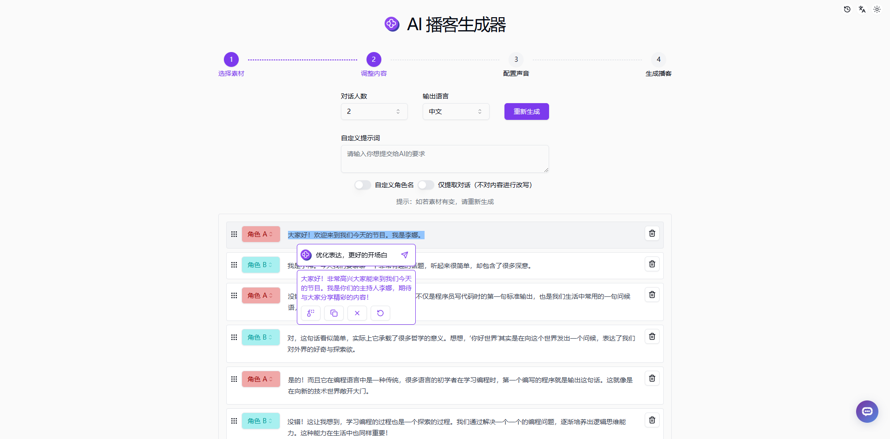
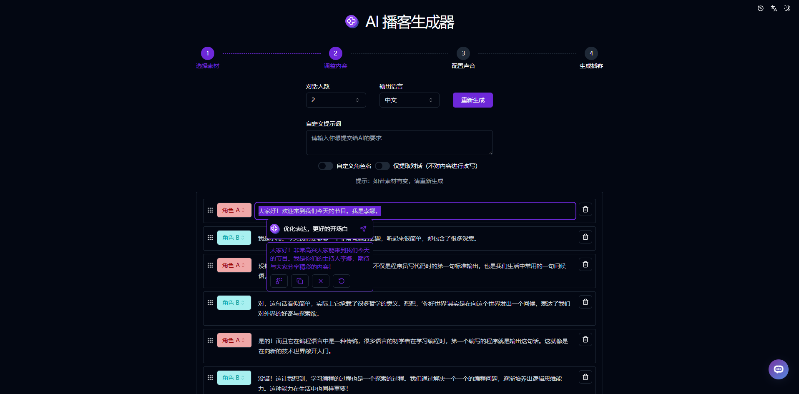
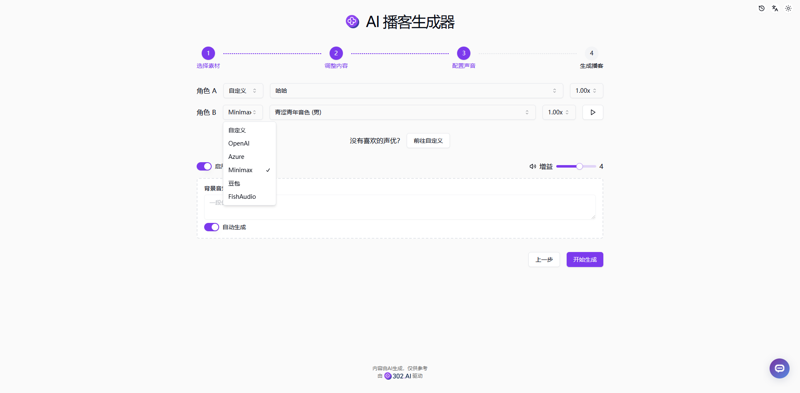
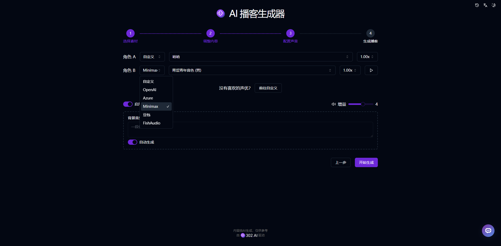
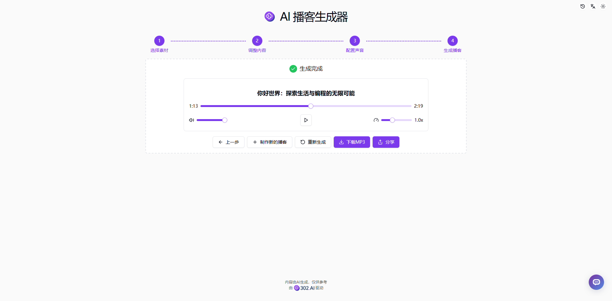
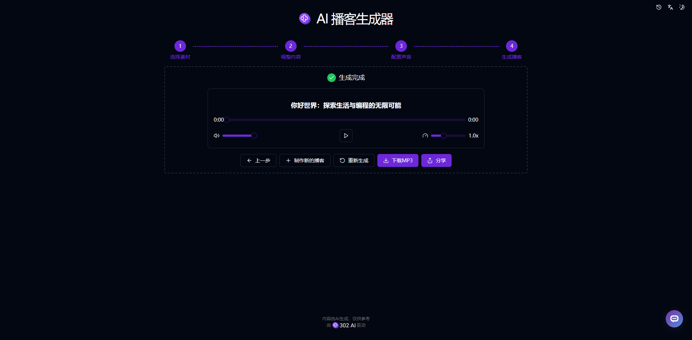

# 🎙️🤖 Welcome to 302.AI's AI Podcast Generator! 🚀✨

[中文](README_zh.md) | [English](README.md) | [日本語](README_ja.md)

Open-source version of the [AI Podcast Generator](https://302.ai/tools/podcast/) from [302.AI](https://302.ai).
You can directly log in to 302.AI for a zero-code, zero-configuration online experience.
Alternatively, customize this project to suit your needs, integrate 302.AI's API KEY, and deploy it yourself.

## ✨ About 302.AI ✨
[302.AI](https://302.ai) is a pay-as-you-go AI application platform, bridging the gap between AI capabilities and practical implementation.
1. 🧠 Comprehensive AI capabilities: Incorporates the latest in language, image, audio, and video models from leading AI brands.
2. 🚀 Advanced application development: We build genuine AI products, not just simple chatbots.
3. 💰 No monthly fees: All features are pay-per-use, fully accessible, ensuring low entry barriers with high potential.
4. 🛠 Powerful admin dashboard: Designed for teams and SMEs - managed by one, used by many.
5. 🔗 API access for all AI features: All tools are open-source and customizable (in progress).
6. 💡 Powerful development team: Launching 2-3 new applications weekly with daily product updates. Interested developers are welcome to contact us.

## Project Features
1. 🎭 AI Character Role-play: Create unique podcast host characters, giving your show a distinctive personality.
2. 📝 Smart Script Generation: Automatically generate structured podcast scripts based on your topics and keywords.
3. ✏️ Real-time Editing: Adjust and modify content during the generation process, even use AI to help you edit.
4. 🗣️ Text-to-Speech: Convert generated scripts into realistic speech, with multiple voices and languages available, even create your own custom voice.
5. 🎶 Background Music and Sound Effects: Automatically add suitable background music and sound effects to enhance the listener experience.
6. 📜 History Record: Save your creation history, never lose your memories, download anytime, anywhere.
7. 🌐 Sharing Support: One-click sharing to major social platforms.
8. 🌓 Dark Mode: Support dark mode to protect your eyes.
9. 🌐 Internationalization: Support multiple languages, currently Chinese, English, and Japanese.

With AI Podcast Generator, anyone can become a podcast creator! 🎉🎙️ Let's explore the new world of AI-driven podcasting together! 🌟🚀

## Tech Stack
- Next.js 14
- Tailwind CSS
- Shadcn UI
- Tiptap
- Vercel AI SDK
- Prisma
- MongoDB

## Development & Deployment
1. Clone the project: `git clone https://github.com/302ai/302_podcast_generator`
2. Install dependencies: `pnpm install`
3. Configure environment variables: Refer to .env.example
4. Run the project: `pnpm prisma generate && pnpm dev`
5. Build and deploy: `docker build -t podcast-generator . && docker run -p 3000:3000 podcast-generator`

## Interface Preview

### 1. Select Materials

### 2. Adjust Content

### 3. Configure Voice

### 4. Generate Podcast

