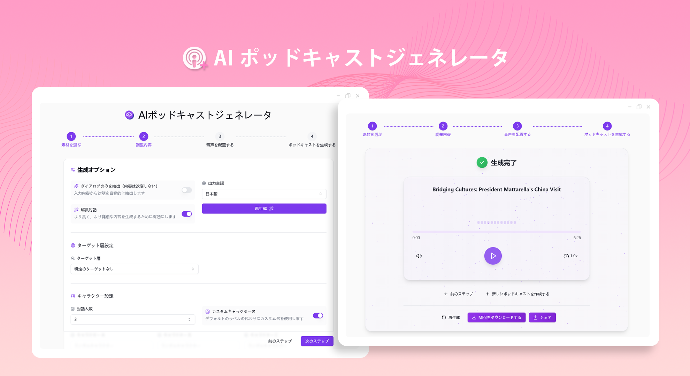
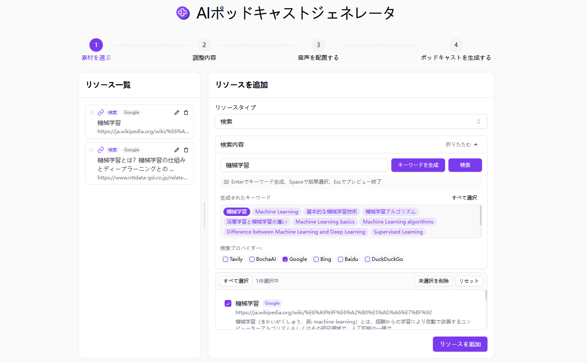
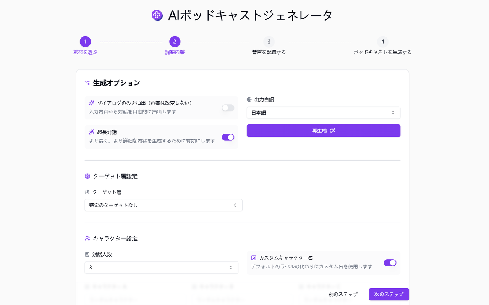
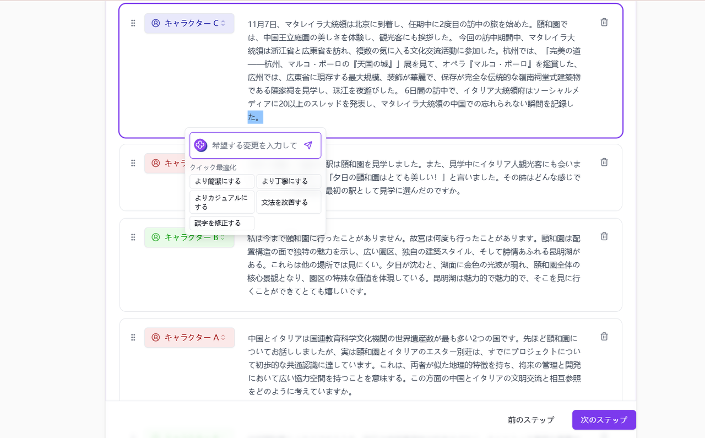
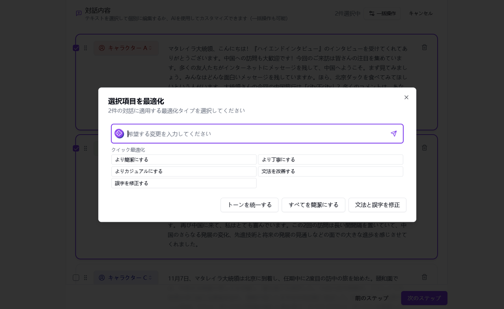
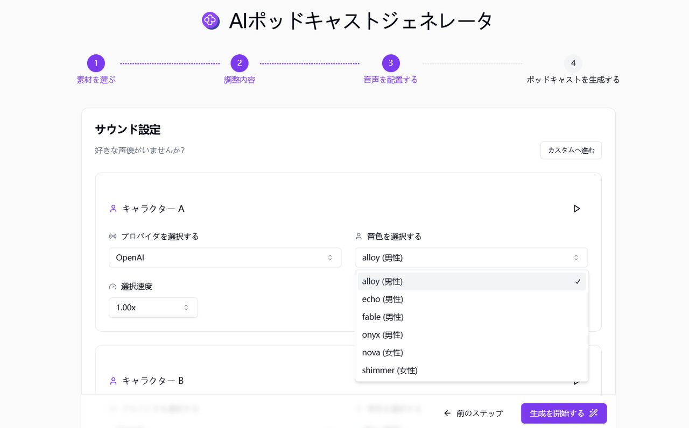
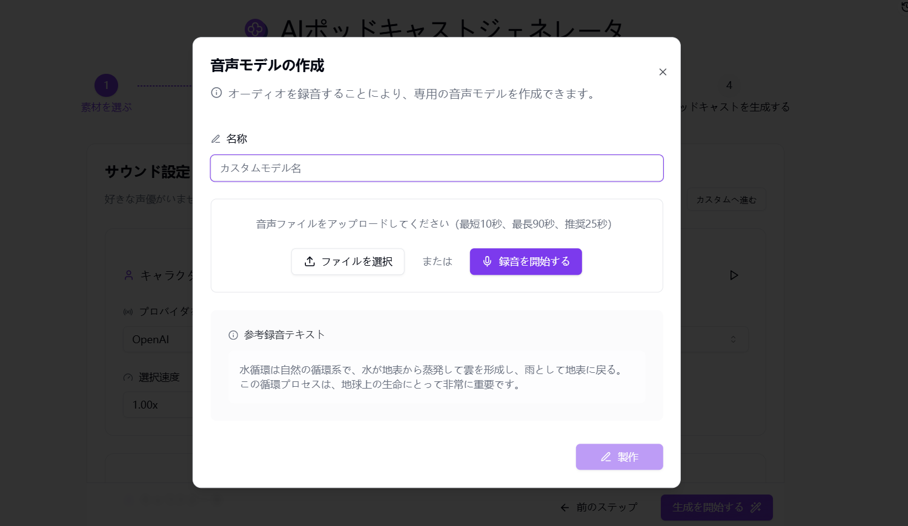
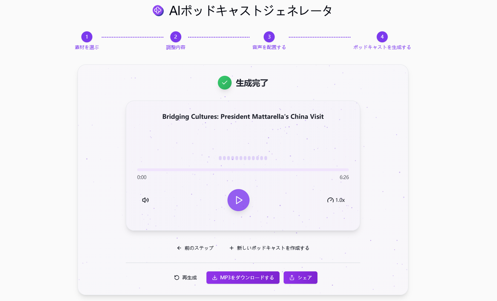

# 
🎙️ AIポッドキャストジェネレータ 🚀✨

AI ポッドキャスト生成器は、画像、テキスト、リンク、ファイルなどの様々な素材を提出することで、大規模言語モデルを利用して会話内容を生成し、また、背景音楽の合成をサポートして、高品質のポッドキャスト音声を生成する。

<a href="README_zh.md">中文</a> | <a href="README.md">English</a> | <a href="README_ja.md">日本語</a>

[302.AI](https://302.ai/ja/)の[AI Podcast Generator](https://302.ai/ja/tools/podcast/)のオープンソース版です。
302.AIに直接ログインすることで、コード不要、設定不要のオンライン体験が可能です。
あるいは、このプロジェクトをニーズに合わせてカスタマイズし、302.AIのAPI KEYを統合して、自身でデプロイすることもできます。

## インターフェースプレビュー
多様な方法でリソースを追加することをサポートし、記述に基づいてキーワードを生成して検索することができ、検索の結果はリソース素材として追加することを選択することができる。
   

「超長会話」機能を使用してポッドキャストスクリプトを生成すると、ポッドキャストコンテンツのターゲットとなる参加者グループを選択するだけでなく、ロール設定やカスタムプロンプトも実行できます。
   

会話が生成されたら、オプションのテキストを個別に編集するか、AIを使用して修正を最適化します。
    

一括アクションのためのダイアログコンテンツを一括選択できます。
    

複数の音声モデルと音声パッケージを選択することができ、バックグラウンドミュージックを選択してポッドキャストの音声を設定することもできます。
    

音声を録音することで、専用の音声モデルを作成することができます。
 

完全なポッドキャストが生成されたら、ダウンロード、共有、または再生成することができます。
 

## プロジェクトの特徴
### 🎯 素材選択
さまざまな方法で素材としてリソースを追加することができます。
### 📝 セッション生成
- 会話の内容を生成するモードを選択したり、プロンプトをカスタマイズしたりできます。
- 参加者選択を提供し、異なる参加者グループに応じてポッドキャストスクリプトの出力トーンを調整できます。
### 🎭 AIロールプレイング
独自のポッドキャストキャスターの役割を作成し、番組に独自の個性を与えます。
### ✏️ リアルタイム編集
- 生成中にコンテンツを調整したり修正したりすることができます。また、AIを使用して編集を支援したり、コンテンツを最適化したりすることもできます。
- 一括選択ダイアログの内容を一括操作でサポートします。
### 🗣️ テキストから音声への変換
生成された脚本をリアルな音声に変換します。複数の音声と言語が選択可能で、あなた自身の専用の音声を作成することさえできます。
### 🎶 背景音楽とサウンドエフェクト
適切な背景音楽とサウンドエフェクトを自動的に追加し、リスナーの体験を強化します。
### 📜 履歴記録
あなたの創作履歴を保存し、記憶が失われることがなく、いつでもどこでもダウンロードできます。
### 🌐 共有サポート
1 クリックで主要なソーシャルプラットフォームに共有できます。
### 🌓 ダークモード
ダークモードをサポートし、あなたの目を保護します。
### 🌍 多言語サポート
- 中国語インターフェース
- 英語インターフェース
- 日本語インターフェース

AI ポッドキャストジェネレーターを使えば、誰でもポッドキャストクリエイターになれます! 🎉🎙️ AI 駆動のポッドキャストの新世界を一緒に探検しましょう! 🌟🚀

## 🚩 将来のアップデート計画
- [ ] 論理的な連続性を最適化する
- [ ] より詳細な個性化されたスタイルカスタマイズオプションを提供し、ユーザーが生成される会話内容のスタイル傾向を正確に設定できるようにし、ポッドキャストが目標聴衆の好みとクリエーターのブランドイメージにより良く適合できるようにする

## 技術スタック
- Next.js 14
- Tailwind CSS
- Shadcn UI
- Tiptap
- Vercel AI SDK
- Prisma
- MongoDB

## 開発&デプロイ
1. プロジェクトをクローン: `git clone https://github.com/302ai/302_podcast_generator`
2. 依存関係をインストール: `pnpm install`
3. 環境変数を設定: .env.example を参照
4. プロジェクトを実行: `pnpm prisma generate && pnpm dev`
5. ビルドとデプロイ: `docker build -t podcast-generator . && docker run -p 3000:3000 podcast-generator`

## ✨ 302.AIについて ✨
[302.AI](https://302.ai)は企業向けのAIアプリケーションプラットフォームであり、必要に応じて支払い、すぐに使用できるオープンソースのエコシステムです。✨
1. 🧠 包括的なAI機能：主要AIブランドの最新の言語、画像、音声、ビデオモデルを統合。
2. 🚀 高度なアプリケーション開発：単なるシンプルなチャットボットではなく、本格的なAI製品を構築。
3. 💰 月額料金なし：すべての機能が従量制で、完全にアクセス可能。低い参入障壁と高い可能性を確保。
4. 🛠 強力な管理ダッシュボード：チームやSME向けに設計 - 一人で管理し、多くの人が使用可能。
5. 🔗 すべてのAI機能へのAPIアクセス：すべてのツールはオープンソースでカスタマイズ可能（進行中）。
6. 💪 強力な開発チーム：大規模で高度なスキルを持つ開発者集団。毎週2-3の新しいアプリケーションをリリースし、毎日製品更新を行っています。才能ある開発者の参加を歓迎します。
