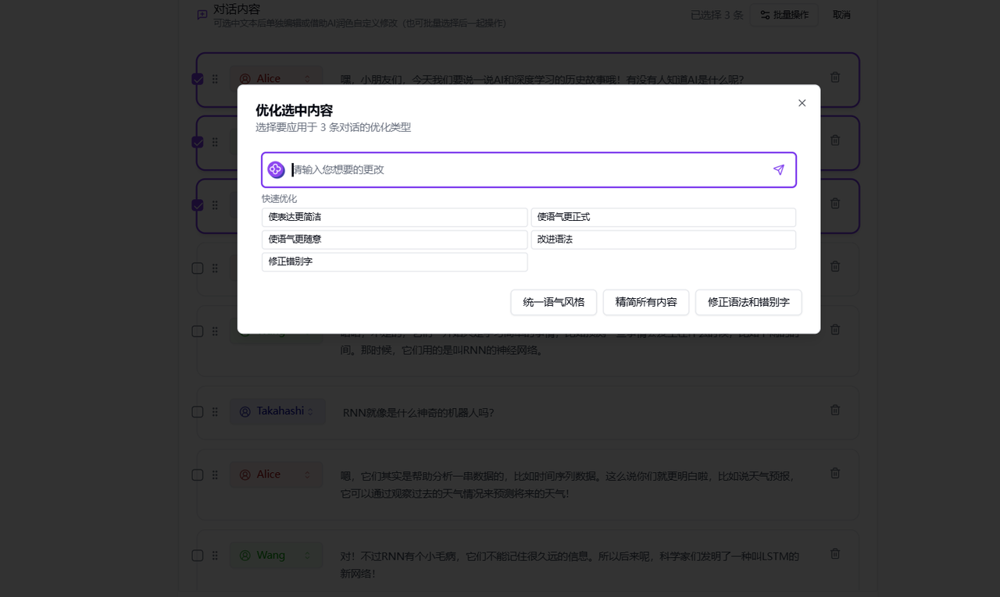
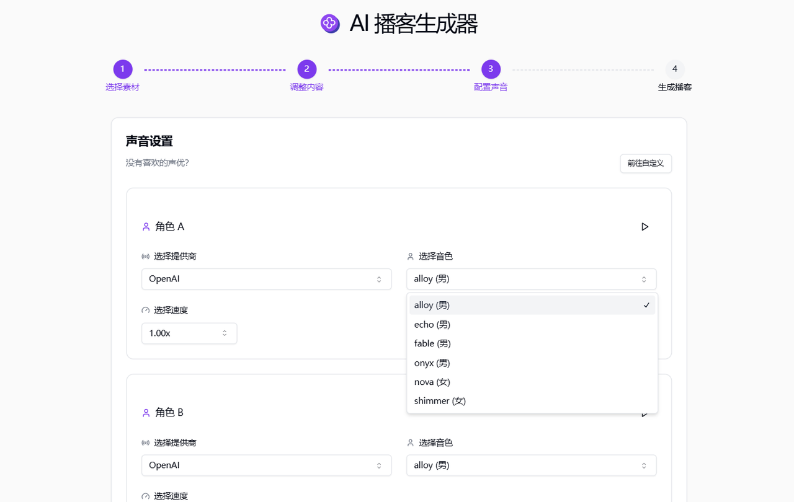

# 
🎙️ AI 播客生成器 🚀✨

AI播客生成器通过提交各种图片、文本、链接、文件等素材，使用大语言模型生成对话内容，并支持合成背景音乐，生成高质量的播客音频。

<a href="README_zh.md">中文</a> | <a href="README.md">English</a> | <a href="README_ja.md">日本語</a>

      

来自[302.AI](https://302.ai)的[AI播客生成器](https://302.ai/tools/podcast/)的开源版本。
你可以直接登录302.AI，零代码零配置使用在线版本。
或者对本项目根据自己的需求进行修改，传入302.AI的API KEY，自行部署。

## 界面预览
使用“超长对话”功能生成播客脚本，不仅可以选择播客内容的目标受众群体，还可以进行角色设置和自定义提示词。
      

生成对话后，可选中文本进行单独编辑或借助AI优化修改。

可以批量选择对话内容进行批量操作。
    

有多种语音模型和语音包可以选择，还可以选择背景音乐，为您的播客配置声音。
    

可以通过录制音频，创建专属的语音模型。
    

完整的播客生成完毕，可下载可分享，也可重新生成。
       

## 项目特性
### 🎭 AI角色扮演
  创建独特的播客主持人角色,赋予您的节目独特的个性。
### 📝 智能脚本生成
  基于您的主题和关键词,自动生成结构化的播客脚本。
### ✏️ 实时编辑
  在生成过程中随时调整和修改内容,甚至可以使用AI来帮助您编辑。
### 🗣️ 文本转语音
  将生成的脚本转换为逼真的语音,多种声音和语言可选，甚至可以制作您的专属声音。
### 🎶 背景音乐和音效
  自动添加合适的背景音乐和音效,增强听众体验。
### 📜 历史记录
  保存您的创作历史,记忆不丢失，随时随地都可以下载。
### 🌐 支持分享
  一键分享到各大社交平台。
### 🌓 暗色模式
  支持暗色模式，保护您的眼睛。
### 🌍 多语言支持
  - 中文界面
  - English Interface
  - 日本語インターフェース

通过Ai播客生成器,任何人都可以成为播客创作者! 🎉🎙️ 让我们一起探索AI驱动的播客新世界吧! 🌟🚀

## 🚩 未来更新计划
- [ ] 逻辑连贯性优化
- [ ] 提供更细致的个性化风格定制选项，让用户能够精准设定生成对话内容的风格倾向，使播客能更好地契合目标受众的喜好以及创作者的品牌形象
  
## 技术栈
- Next.js 14
- Tailwind CSS
- Shadcn UI
- Tiptap
- Vecel AI SDK
- Prisma
- MongoDB

## 开发&部署
1. 克隆项目 `git clone https://github.com/302ai/302_podcast_generator`
2. 安装依赖 `pnpm install`
3. 配置302的API KEY 参考.env.example
4. 运行项目 `pnpm prisma generate && pnpm dev`
5. 打包部署 `docker build -t podcast-generator . && docker run -p 3000:3000 podcast-generator`

## ✨ 302.AI介绍 ✨
[302.AI](https://302.ai)是一个面向企业的AI应用平台，按需付费，开箱即用，开源生态。✨
1. 🧠 集合了最新最全的AI能力和品牌，包括但不限于语言模型、图像模型、声音模型、视频模型。
2. 🚀 在基础模型上进行深度应用开发，我们开发真正的AI产品，而不是简单的对话机器人
3. 💰 零月费，所有功能按需付费，全面开放，做到真正的门槛低，上限高。
4. 🛠 功能强大的管理后台，面向团队和中小企业，一人管理，多人使用。
5. 🔗 所有AI能力均提供API接入，所有工具开源可自行定制（进行中）。
6. 💡 强大的开发团队，每周推出2-3个新应用，产品每日更新。有兴趣加入的开发者也欢迎联系我们

